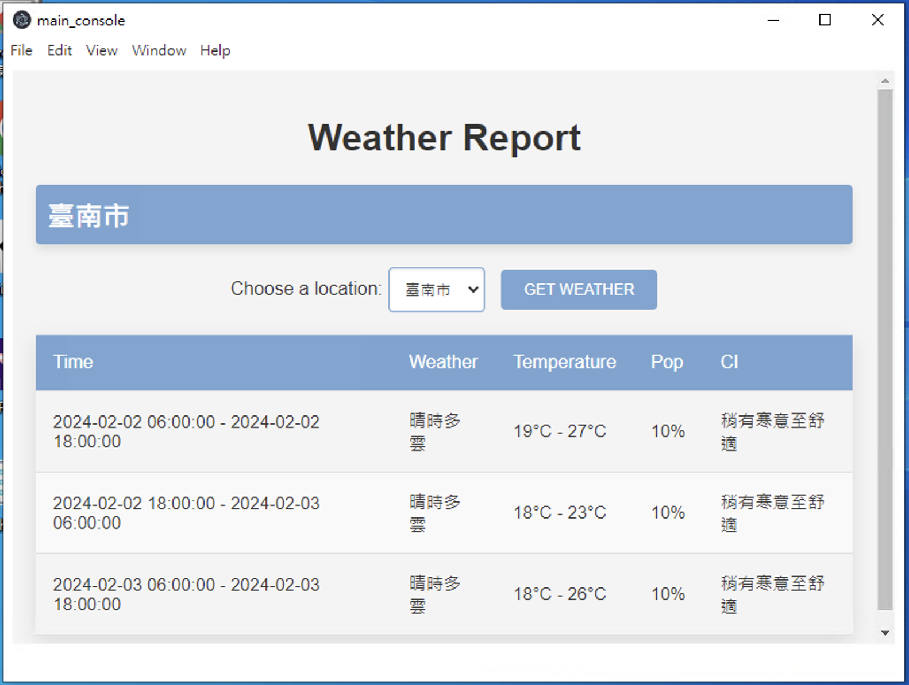

# DEMO_Vue_Flask_Electron_APP 整合應用程式

本專案展示如何使用 Electron 來整合 Vue.js 和 Flask，形成一個互動式的應用程式。在這個應用程式中，Flask 作為後端伺服器，它會隨著應用程式的啟動而運行，這允許在 Electron 框架下運行的 Vue.js 前端進行 API 請求或執行其他操作。



## 專案開發

### 服務器

請閱讀 `./backend/Readme.md` 進行安裝

### 主程式

首先，安裝專案所需的依賴項目：

```bash
npm install
```

### 開發時編譯和熱重載

要在開發環境下啟動專案，請運行以下命令，它會啟用熱重載功能，讓你在開發時能即時看到變更效果：

```bash
npm run dev
```

### 生產環境編譯和壓縮

為了準備生產環境的發佈，運行以下命令來編譯和壓縮專案文件：

```bash
npm run publish
```

### Lints 和文件修正

運行下面的命令來檢查和修復檔案中的語法錯誤或格式問題：

```bash
npm run lint
```

---

請注意，若有特定於專案的配置或命令，建議在 README.md 中詳細說明，以便於新使用者理解和運行專案。若有附加的配置文件或需要預先設置的環境變量，也應在文檔中提供相應的說明。